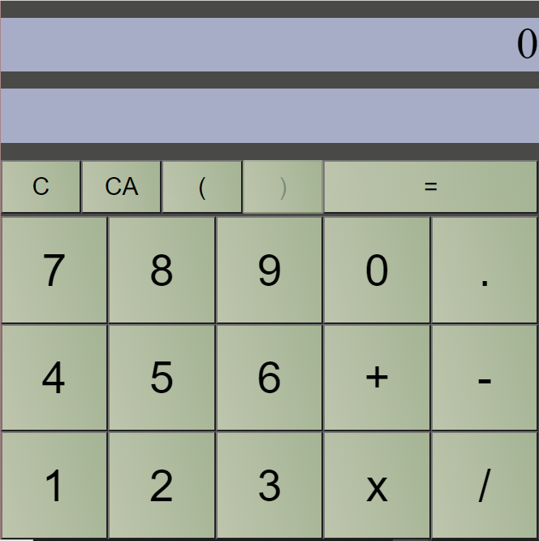

# React Hook Calculator

  React Calculator has been finished.
  
  
  
  Features:
  
  Operators fully functional
  Parenthesis functions including
  multiplication and others.
  
  React Hook used is useState
  but if we can make it cleaner,
  we can use useReduce instead.
  

  Website is here: https://darealtube.github.io/React-Calculator/
  
  To run it on your local machine clone into the repo, then type: 

    npm install && npm start
    
